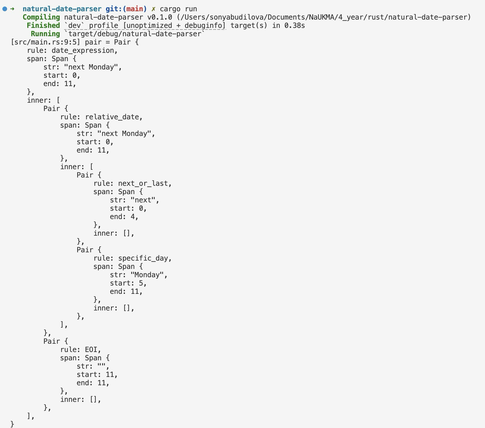

# Natural Date Parser

## Brief Description

A parser that converts natural language date and time expressions into Rust-compatible DateTime formats.

**Natural Date Parser** is a Rust project designed to parse human-friendly, natural language date and time expressions, such as "next Monday," "tomorrow at 5 PM," or "3 weeks from now." This parser converts these expressions into structured `DateTime` objects, making them usable in scheduling applications, reminders, or other time-based software.

## Technical Description

### Parsing Process

The parser is built using the [Pest](https://pest.rs/) parsing library and is designed to recognize a variety of natural language phrases related to dates and times. These include:

- **Simple Relative Dates**: "today," "tomorrow," "yesterday."
- **Day of the Week Expressions**: "next Monday," "last Friday."
- **Complex Relative Time Expressions**: "in 3 days," "2 weeks from now," "4 months ago."
- **Combined Date and Time Expressions**: "next Thursday at 10 AM," "tomorrow at 5:30 PM."

### How It Works

The parsing process follows these steps:

1. **Tokenization and Grammar Definition**: The parser uses Pest to define grammar rules for recognizing date keywords (e.g., "next," "last"), day names (e.g., "Monday," "Sunday"), and time phrases (e.g., "at 5 PM").
2. **Mapping to Date Components**: Once the input text is parsed, it is converted into date and time components, such as days, months, and hours. These components are passed to Rust’s `chrono` library to calculate the exact `DateTime` value.
3. **Error Handling**: If an unrecognized phrase is entered, the parser provides an error message guiding the user to valid inputs.

### Use Cases

The output `DateTime` values can be used in a variety of applications:

- **Scheduling Apps**: Automatically parse reminders like "next Monday" and "in 3 days" into exact dates.
- **Task Management**: Set deadlines with natural language, making it easier to schedule tasks.
- **Chatbots and Virtual Assistants**: Interpret user queries about dates and times with ease.

## Getting Started

To start using **Natural Date Parser**, you can use [crate](https://crates.io/crates/natural-date-parser) on crates.io

### Example Usage

```rust
fn main() -> anyhow::Result<()> {
    let pair = Grammar::parse(Rule::date_expression, "next Monday")?
        .next()
        .ok_or_else(|| anyhow!("no pair"))?;
    dbg!(pair);
    Ok(())
}
```


